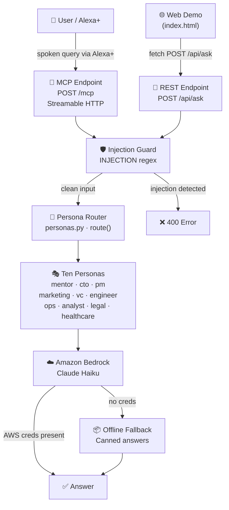

# Architecture — Mentor AI for Alexa+

## System Overview

Mentor AI is a self-hosted **Model Context Protocol (MCP)** server that:

1. Accepts spoken or typed questions via Alexa+ or the web demo.
2. Routes each question to the best-matched expert persona using keyword scoring.
3. Calls **Amazon Bedrock** (Claude Haiku) with a persona-specific system prompt.
4. Returns a short, voice-ready answer.

---

## Component Diagram



---

## Data Flow — Happy Path

```
sequenceDiagram
    participant A as Alexa+ / Web Demo
    participant S as MCP Server
    participant G as Injection Guard
    participant R as Persona Router
    participant B as Amazon Bedrock

    A->>S: POST /mcp  {question: "How do I raise a Series A?"}
    S->>G: INJECTION.search(question)
    G-->>S: no match — clean
    S->>R: route(question)
    R-->>S: Persona = "vc"
    S->>B: invoke_model(system=vc_prompt, user=question)
    B-->>S: "Focus on product-market fit…"
    S-->>A: {persona: "vc", answer: "…"}
```

---

## Directory Layout

```
mentor-ai-alexa/
├── server/
│   ├── server.py       ← FastMCP entry point; MCP tools + /api/ask + /health
│   ├── personas.py     ← Persona registry, keyword router, collision check
│   ├── bedrock.py      ← Bedrock client + offline fallback
│   ├── limiter.py      ← Per-IP rate limiter (sliding window)
│   ├── requirements.txt
│   └── Dockerfile
├── web/
│   ├── index.html      ← Single-page demo site
│   ├── style.css       ← Light/dark responsive CSS
│   └── app.js          ← SpeechRecognition + speechSynthesis + /api/ask
├── docs/
│   ├── ARCHITECTURE.md (this file)
│   ├── DEPLOY.md
│   ├── FRICTION_LOG.md
│   └── FEEDBACK.md
└── tests/
    ├── test_routing.py
    ├── test_injection.py
    └── test_api.py
```

---

## Key Design Decisions

| Decision | Rationale |
|---|---|
| FastMCP + Streamable HTTP | Native MCP SDK transport; connects directly to Alexa+ and MCP Inspector |
| Plain HTML/CSS/JS website | Zero build step; judges can open `index.html` without Node.js |
| Keyword-score routing | Deterministic, testable, no extra LLM call needed |
| Offline fallback | Server is usable without AWS credentials for demos and CI |
| In-process rate limiter | No Redis dependency; acceptable for hackathon single-instance deploy |
| `legal` + `healthcare` disclaimers | Ethical safeguard: regulated domain answers always carry a disclaimer |

---

## AWS Services Used

| Service | Role |
|---|---|
| **Amazon Bedrock** | LLM inference (Claude Haiku model) |
| **AWS App Runner** | Serverless container hosting; auto-scales, TLS termination |
| **Amazon ECR** | Container image registry |

---

## Security Properties

- **Prompt-injection guard**: `INJECTION` regex in `server.py` blocks jailbreak patterns before any Bedrock call. The guard is never weakened.
- **No secrets in code**: all credentials via environment variables.
- **Rate limiting**: 10 req/60 s per IP.
- **CORS**: origin-restricted in production via `CORS_ORIGIN` env var.
